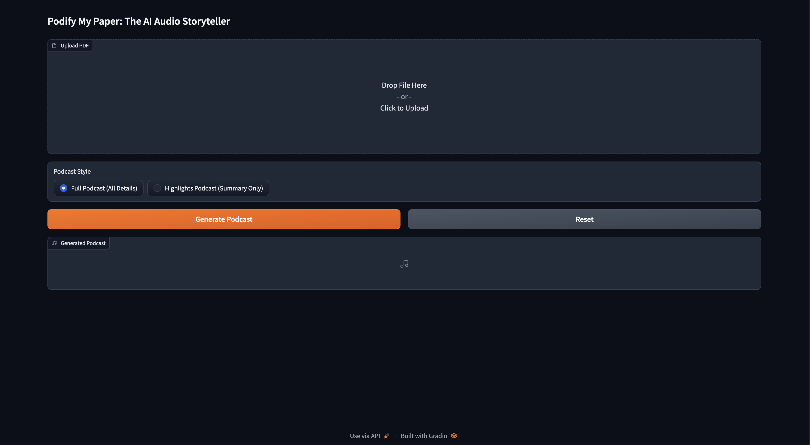
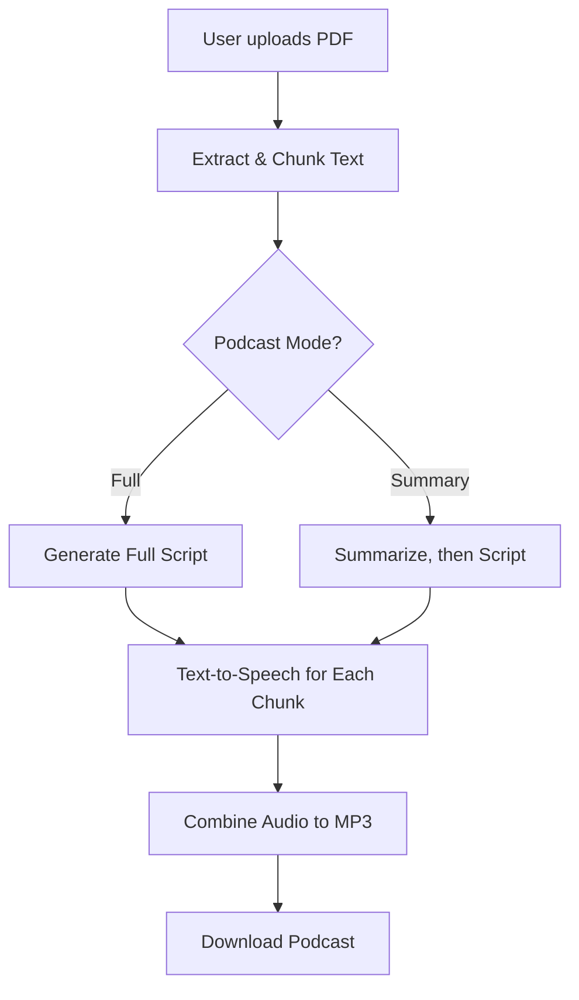

# Podify My Paper: The AI Audio Storyteller

## Overview

Podify My Paper instantly transforms your research papers, academic PDFs, or technical documents into engaging, AI-narrated podcast episodes. No technical skills required! Just upload your PDF, choose your preferred podcast style, and let advanced AI models craft a natural, insightful dialogue between two expert speakers. Download and share your audio podcast in minutes.

Whether you want a deep-dive discussion or a concise highlights summary, Podify My Paper brings your ideas to life through conversational storytelling.

## App Screenshot

Here's what the app looks like:



## Demo Video

Want to see Podify My Paper in action?

[](https://github.com/nishanttomar21/podify-my-paper/assets/demo.mp4)

## Flow Diagram



## How It Works

1. **Upload PDF**  
   Upload any academic, research, or technical PDF using the web interface.

2. **Choose Podcast Style**  
   - **Full Podcast (All Details):** Converts your entire document into a detailed, conversational podcast.
   - **Highlights Podcast (Summary Only):** Generates a concise, summary-focused podcast episode.

3. **AI Script Generation**  
   - Uses **Google Gemini (Generative AI)** to analyze your document, summarize content (if needed), and create a natural back-and-forth script between "Nishant" (host) and "Megha" (expert guest).
   - For longer documents, splits content into chunks to ensure smooth, manageable podcast segments.

4. **Text-to-Speech Audio Creation**  
Each line of the script is converted to speech using realistic voices. You can now choose between:

- **Murf AI TTS (multi-voice, cross-platform):**  
  The default, recommended option, with natural-sounding voices for both host and guest. No platform restrictions!

- **macOS Say Command (optional):**  
  For Mac users who want to use built-in lifelike voices.

- **gTTS (optional):**  
  For simple, single-voice cross-platform support.

> **Note:** Murf AI is now integrated and used by default for the best-quality, multi-speaker experience.

5. **Download Podcast**  
   - All audio segments are combined into a single MP3.
   - Download and listen to your personalized podcast episode!

## Features

- **Podcast from PDF:** Upload any research paper or technical PDF and generate a podcast script in a realistic dialogue format.
- **Two Speaker Roles:** Realistic back-and-forth between "Nishant" (host) and "Megha" (expert guest).
- **Detailed or Highlight Mode:** Choose between a full deep-dive or a concise highlights-only summary podcast.
- **AI Summarization & Scripting:** Uses Google Gemini (Generative AI) for natural, context-aware podcast scripts.

**Text-to-Speech:**
- **Murf AI Integration:** Best-in-class, lifelike AI voices for both host and guest (multi-voice, cross-platform, high quality).
- **macOS 'say' (Optional):** Leverage built-in Mac voices for local TTS.
- **gTTS (Optional):** Simple, universal fallback.

- **Easy Web UI:** Built with Gradio for one-click use—no code required for users.

## Requirements

- **Python:** 3.8 or higher
- **Google Gemini API Key:** Required for AI podcast script and summarization. [Sign up here.](https://aistudio.google.com/app/apikey)
- **Murf AI API Key:** Required for Murf TTS voice generation. [Get your Murf API key here.](https://murf.ai/)

**Audio Generation:**
- **Default:** Uses Murf AI for multi-voice TTS on all platforms.
- **macOS (optional):** Uses the built-in `say` command for lifelike podcast voices.
- **Windows/Linux (optional):** Uses gTTS (Google Text-to-Speech) for cross-platform speech synthesis.

**Python Dependencies:**
- All required Python packages are listed in `requirements.txt`.

## Installation

```bash
git clone https://github.com/nishanttomar21/podify-my-paper.git
cd podify-my-paper
pip install -r requirements.txt
```

## Usage

### 1. Set up API Key(s):

You'll need API keys for:

- **Google Gemini** (Generative AI)
- **Murf AI TTS**

You can provide your API keys in one of two ways:

**Option 1: Directly edit the code (`main.py`) and replace:**

```python
GEMINI_API_KEY = "Enter-your-api-key"
MURF_API_KEY = "Enter-your-murf-api-key"
```

**Option 2 (Recommended): Set the keys as environment variables in your terminal:**

```bash
export GEMINI_API_KEY=your_actual_gemini_key_here
export MURF_API_KEY=your_actual_murf_key_here
```

On **Windows**, use:

```cmd
set GEMINI_API_KEY=your_actual_key_here
set MURF_API_KEY=your_actual_murf_key_here
```

### 2. Run the App

After installation and setting the API key, start the web app with:

```bash
python main.py
```

## Credits

- [Gradio](https://gradio.app/) for the simple, no-code UI.
- [Google Gemini API](https://aistudio.google.com/app/apikey) for natural script generation and summarization.
- [Murf AI](https://murf.ai/) for high-quality, multi-voice audio generation.
- [gTTS](https://pypi.org/project/gTTS/) and [pydub](https://github.com/jiaaro/pydub) for TTS and audio processing utilities.

