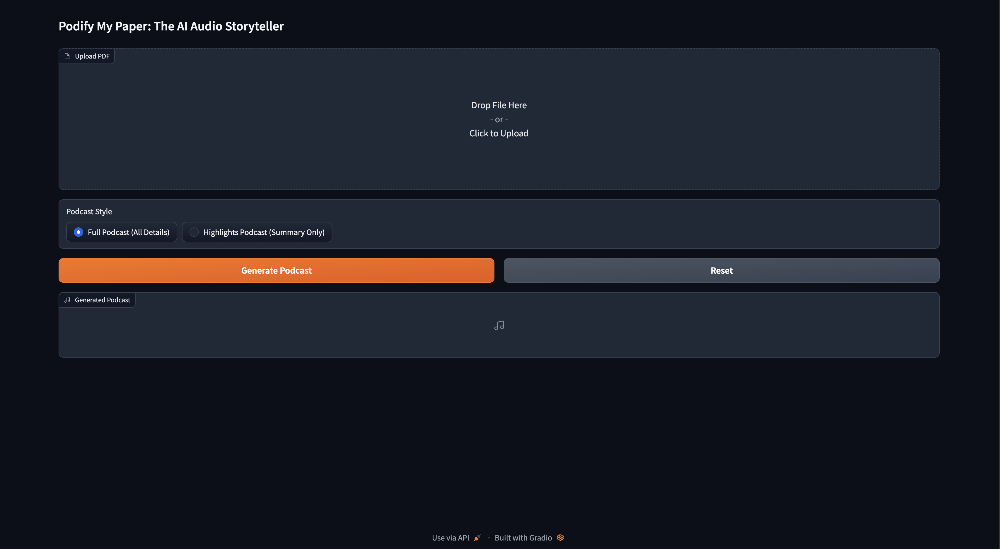
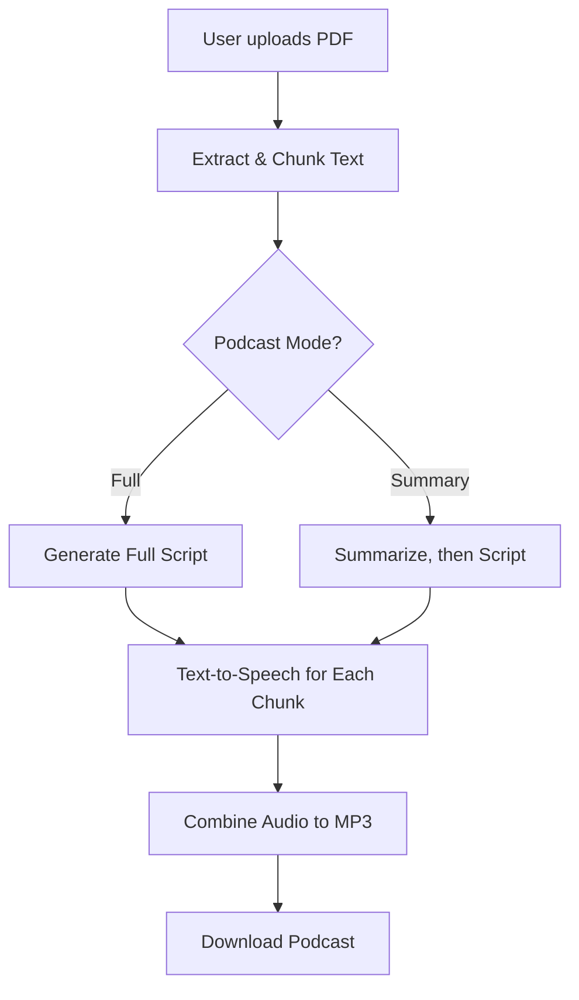

# Podify My Paper: The AI Audio Storyteller

## Overview

Podify My Paper instantly transforms your research papers, academic PDFs, or technical documents into engaging, AI-narrated podcast episodes. No technical skills required! Just upload your PDF, choose your preferred podcast style, and let advanced AI models craft a natural, insightful dialogue between two expert speakers. Download and share your audio podcast in minutes.

Whether you want a deep-dive discussion or a concise highlights summary, Podify My Paper brings your ideas to life through conversational storytelling.

## App Screenshot

Here's what the app looks like:



## 📊 Flow Diagram



## 🚦 How It Works

1. **Upload PDF**  
   Upload any academic, research, or technical PDF using the web interface.

2. **Choose Podcast Style**  
   - **Full Podcast (All Details):** Converts your entire document into a detailed, conversational podcast.
   - **Highlights Podcast (Summary Only):** Generates a concise, summary-focused podcast episode.

3. **AI Script Generation**  
   - Uses **Google Gemini (Generative AI)** to analyze your document, summarize content (if needed), and create a natural back-and-forth script between "Nishant" (host) and "Megha" (expert guest).
   - For longer documents, splits content into chunks to ensure smooth, manageable podcast segments.

4. **Text-to-Speech Audio Creation**  
   - Each line of the script is converted to speech using realistic voices:
     - On **macOS**, uses the built-in `say` command for lifelike voices.
     - On **Windows/Linux**, uses [gTTS](https://pypi.org/project/gTTS/) for cross-platform support.

5. **Download Podcast**  
   - All audio segments are combined into a single MP3.
   - Download and listen to your personalized podcast episode!

## 🚀 Features

- **Podcast from PDF:** Upload any research paper or technical PDF and generate a podcast script in a realistic dialogue format.
- **Two Speaker Roles:** Realistic back-and-forth between "Nishant" (host) and "Megha" (expert guest).
- **Detailed or Highlight Mode:** Choose between a full deep-dive or a concise highlights-only summary podcast.
- **AI Summarization & Scripting:** Uses Google Gemini (Generative AI) for natural, context-aware podcast scripts.
- **Text-to-Speech:** Audio generated with realistic voices (best with Mac; cross-platform option included).
- **Easy Web UI:** Built with Gradio for one-click use—no code required for users.

## 🖥️ Requirements

- Python 3.8 or higher
- [Google Generative AI API Key](https://ai.google.dev/)
- macOS (for most realistic voices via `say` command) OR Windows/Linux (using gTTS, see below)
- See [requirements.txt](requirements.txt) for Python packages.

## ⚙️ Installation

```bash
git clone https://github.com/nishanttomar21/podify-my-paper.git
cd podify-my-paper
pip install -r requirements.txt
```
