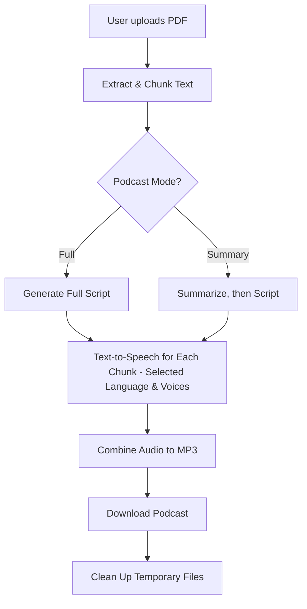

# Podify My Paper: The AI Audio Storyteller

## Overview

Podify My Paper instantly transforms your research papers, academic PDFs, or technical documents into engaging, AI-narrated podcast episodes. No technical skills required! Just upload your PDF, choose your preferred podcast style, language and let advanced AI models craft a natural, insightful dialogue between two expert speakers. Download and share your audio podcast in minutes.

Whether you want a deep-dive discussion or a concise highlights summary, Podify My Paper brings your ideas to life through conversational storytelling.

## What’s New

- **Language Selection:**  
  Supports English, Hindi, German, and French. Generate podcasts in your preferred language.  
- **Multi-Voice, Multi-Language Audio:**  
  Murf AI produces high-quality voices for both "Nishant" and "Megha" in all supported languages (where available).

## Demo Video

See Podify My Paper in action!

https://github.com/user-attachments/assets/deb178b9-facb-410b-aa2c-2d367f90dacc

## Flow Diagram


```mermaid
graph TD
    A[User uploads PDF] --> B[Extract & Chunk Text]
    B --> C{Podcast Mode?}
    C -- Full --> D[Generate Full Script]
    C -- Summary --> E[Summarize, then Script]
    D --> F[Text-to-Speech for Each Chunk - Selected Language & Voices]
    E --> F
    F --> G[Combine Audio to MP3]
    G --> H[Download Podcast]
    H --> I[Clean Up Temporary Files]
```

## How It Works

1. **Upload PDF**  
   Upload any academic, research, or technical PDF using the web interface.

2. **Choose Podcast Style**  
   - **Full Podcast (All Details):** Converts your entire document into a detailed, conversational podcast.
   - **Highlights Podcast (Summary Only):** Generates a concise, summary-focused podcast episode.

3. **Select Language**  
   Choose from English, Hindi, German, or French for your podcast’s narration and script.

4. **AI Script Generation**  
   - Uses **Google Gemini (Generative AI)** to analyze your document, summarize content (if needed), and create a natural back-and-forth script between "Nishant" (host) and "Megha" (expert guest).
   - For longer documents, splits content into chunks to ensure smooth, manageable podcast segments.

5. **Text-to-Speech Audio Creation**  
Each line of the script is converted to speech using realistic voices. You can now choose between:

   - **Murf AI TTS (multi-voice, cross-platform):**  
     The default, recommended option, with natural-sounding voices for both host and guest. No platform restrictions!

   - **macOS Say Command (optional):**  
     For Mac users who want to use built-in lifelike voices.

   - **gTTS (optional):**  
     For simple, single-voice cross-platform support.

> **Note:** Murf AI is now integrated and used by default for the best-quality, multi-speaker experience.

6. **Download Podcast**  
   - All audio segments are combined into a single MP3.
   - Download and listen to your personalized podcast episode!

7. **Automatic Cleanup**  
   Temporary audio chunks are deleted after the MP3 is created.

## Features

- **PDF-to-Podcast:** Converts any research or technical PDF into a two-speaker podcast.

- **Multi-Language Support:** Supports **English, Hindi, German, and French** with AI-powered translation.

- **Multi-Voice Support:** Both **host** and **guest** have their own unique, realistic AI voices (via **Murf**).

- **AI Summarization:** Generate either a **detailed** or **summary-based** podcast episode.

- **Web UI:** Easy-to-use **Gradio interface**—no coding required.

- **Automatic Cleanup:** Cleans up all intermediate audio files from `podcast_chunks` after each run.

## Requirements

- **Python:** 3.8 or higher
- **Google Gemini API Key:** Required for AI podcast script and summarization. [Sign up here.](https://aistudio.google.com/app/apikey)
- **Murf AI API Key:** Required for Murf TTS voice generation. [Get your Murf API key here.](https://murf.ai/)
- **Python Dependencies:** See `requirements.txt`.

## Installation

```bash
git clone https://github.com/nishanttomar21/podify-my-paper.git
cd podify-my-paper
pip install -r requirements.txt
```

## Usage

### 1. Set up API Key(s):

You'll need API keys for:

- **Google Gemini** (Generative AI)
- **Murf AI TTS**

You can provide your API keys in one of two ways:

**Option 1: Directly edit the code (`main.py`) and replace:**

```python
GEMINI_API_KEY = "Enter-your-api-key"
MURF_API_KEY = "Enter-your-murf-api-key"
```

**Option 2 (Recommended): Set the keys as environment variables in your terminal:**

```bash
export GEMINI_API_KEY=your_actual_gemini_key_here
export MURF_API_KEY=your_actual_murf_key_here
```

On **Windows**, use:

```cmd
set GEMINI_API_KEY=your_actual_key_here
set MURF_API_KEY=your_actual_murf_key_here
```

### 2. Run the App

After installation and setting the API key, start the web app with:

```bash
python main.py
```

## Changelog

### v2.0

- **Language selection:** English, Hindi, German, French
- **Translation:** Scripts are translated automatically, and multi-voice TTS is supported per language
- **Automatic cleanup:** The `podcast_chunks` folder is cleaned after MP3 creation

## Credits

- [Gradio](https://gradio.app/) – Easy-to-use web UI for the app  
- [Google Gemini API](https://aistudio.google.com/app/apikey) – AI script generation & summarization  
- [Murf AI](https://murf.ai/) – High-quality, multi-voice text-to-speech  
- [gTTS](https://pypi.org/project/gTTS/) – Alternative simple TTS engine  
- [pydub](https://github.com/jiaaro/pydub) – Audio processing and MP3 export  

## License

[MIT License](LICENSE)
